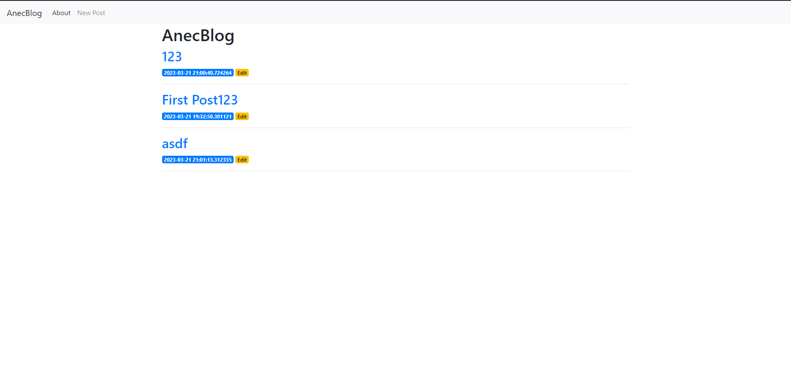
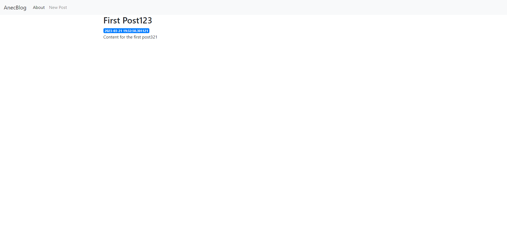
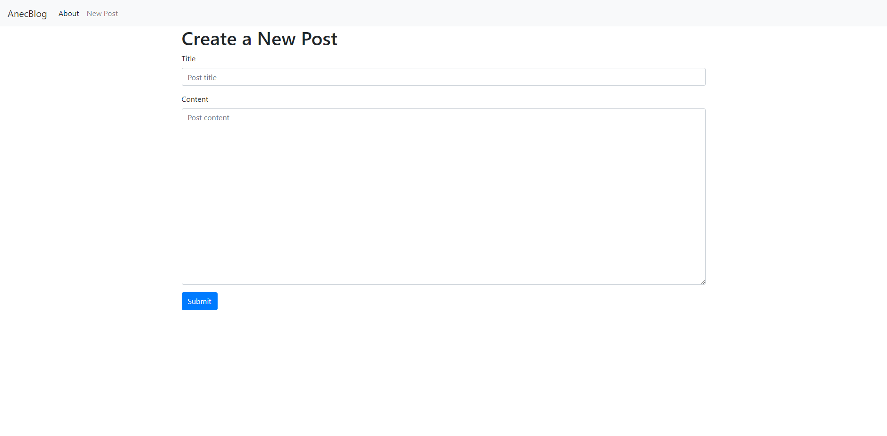
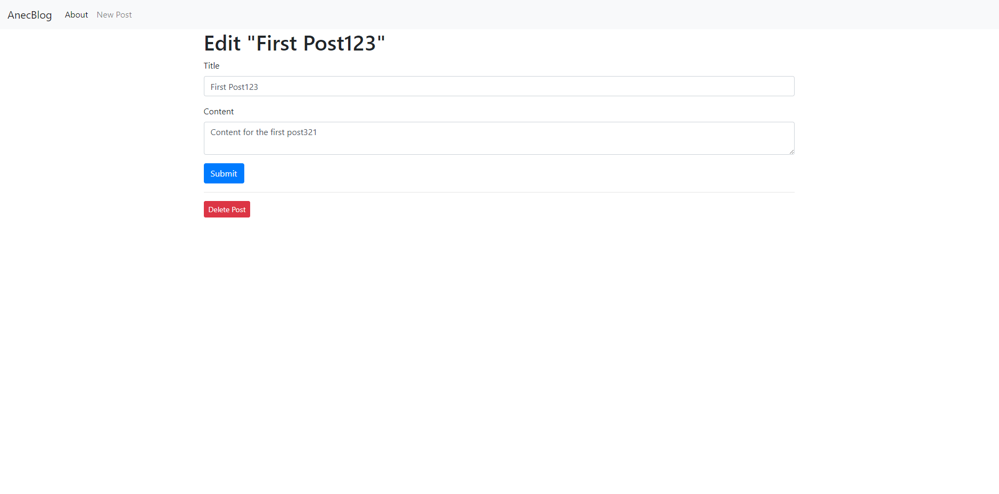

# AnecBlog
## Description
Blog for anecdotes(jokes). You can watch, post, and edit anecdotes.

## Screenshots
<p float="left">
 
</p>
<p float="left">
 
</p>
<p float="left">
 
</p>
<p float="left">
 
</p>

## Stack
Python
Flask

## How to run
```
pip install flask
pip install psycopg2
```
Set you PostgreSQL database and fill your login information into app.py and db.py
```
flask run
```
